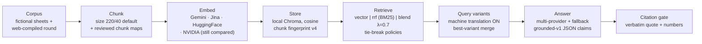
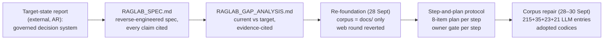
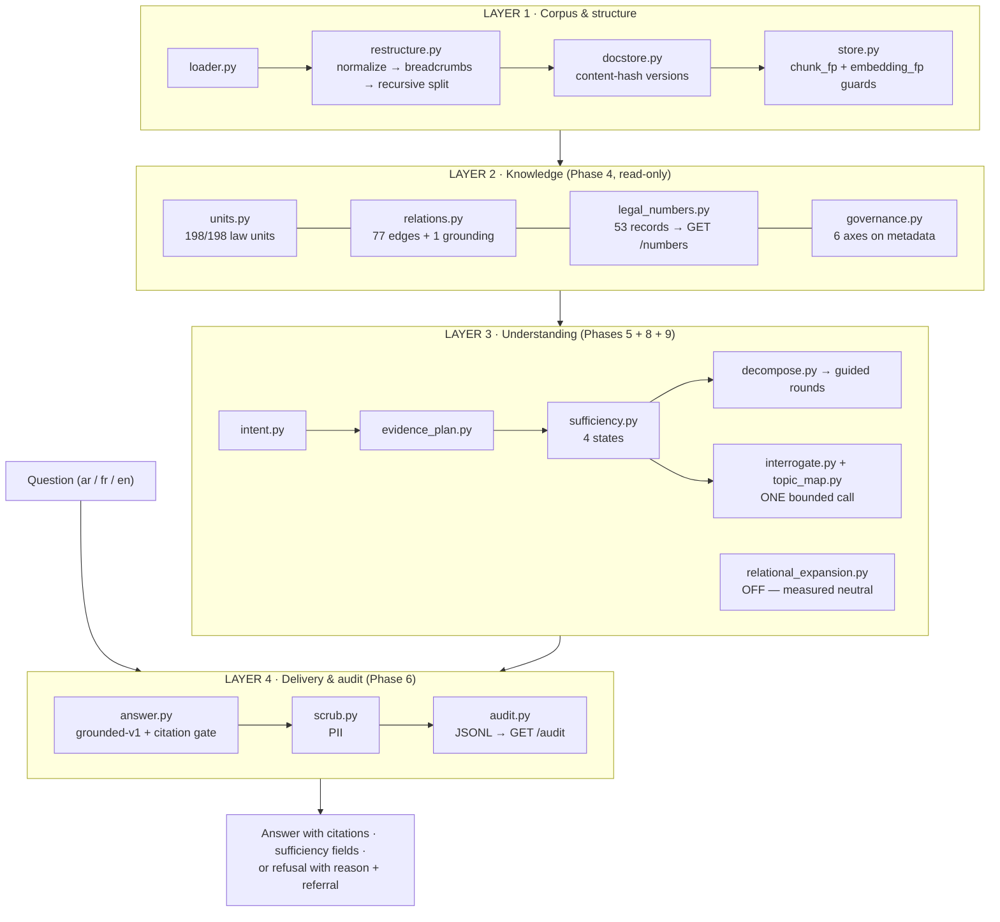

# RAGLab — Architecture Schema

> **What this document is.** A single, evidence-based schema of the RAGLab architecture,
> written to sit *before* the internship report. It shows **two generations of the
> architecture**, **the pivot between them**, and **the current revision — which is
> highlighted throughout** so the latest state is never confused with the historical one.
>
> **Visual companions:** [`architecture_schema.svg`](architecture_schema.svg) / [`architecture_schema.png`](architecture_schema.png) (self-contained, printable) and
> [`timeline.png`](timeline.png) (development timeline). Everything below is the same schema
> in text, with sources.
>
> **Placeholders:** this file contains no personal names. The report uses the placeholder
> convention described in `INTERNSHIP_REPORT.md`.

---

## 0. Snapshot at HEAD (05 Oct 2026)

| Fact | Value | Source |
|---|---|---|
| Commits reachable in the repository | **387** (384 non-merge) across 15 branches, ~30 tags | `git rev-list --all --count` |
| Development window | **04 Sept → 05 Oct 2026** | commit dates |
| Tracked files / code | 220 files · **39,491 lines of Python** (28,454 core + 11,037 tests) · 28,218 lines of Markdown | `git ls-files`, `wc -l` |
| Service | **`SERVICE_VERSION = "1.5.0"`**, **27 HTTP routes** | `raglab/service.py` |
| Corpus | 4 real documents (2 PDF, 2 DOCX), all Arabic · 339 chunks on the adopted arm (fallback estimator) / 858 (CI `cl100k`) | `raglab/audits/MASTER_INDEX.md`, `AGENTS.md` |
| Frozen question sets | `questions_50.json` (50 cases) + `questions_targets.json` (10 cases) | `raglab/audits/QUESTIONS_MATRIX.md` |
| Offline gate on the current revision | `EXIT=0`, **Ran 463 tests OK, 121 PASS**; CI run `37293172975` green (offline + Docker import smoke) | HEAD commit message, Actions |
| Runtime pair (pinned) | embeddings `nvidia/nemotron-3-embed-1b` (2048-d) · answers `qwen/qwen3.8-max:free` via xKiro | `raglab/pipeline_policy.py` |

---

## 1. The change, in one page

```
04–23 Sept   GENERATION 1 — flat retrieval lab
             multi-provider · machine translation · hybrid fusion explored by A/B

24–28 Sept   THE PIVOT — target-state report → gap analysis → re-foundation
             corpus = docs/ only · step-and-plan protocol · owner gates · repaired codices

24 Sept–05 Oct  GENERATION 2 — governed layered pipeline
             structure → knowledge → understanding → delivery
             ★ 05 Oct: Phase 9 (question ↔ retrieval link), service 1.5.0  ← CURRENT
```

**Why it changed.** Generation 1 answered a *measurement* question (“which chunking /
embedder / fusion wins?”). The external target-state report asked for a *decision* system
(“what does the document say, is the evidence sufficient, and what happens when it is
not?”). Those need different architectures: a flat pipeline can be tuned, but it cannot
guarantee structured units, evidence requirements, sufficiency states, or an audit trail.
The pivot kept the good parts (citation gate, fingerprint refusal, measured A/B discipline)
and added the layers the target design required, one owner-gated step at a time.

---

## 2. Generation 1 — the flat retrieval lab (04 → 23 Sept 2026)



| Aspect | Generation 1 behaviour |
|---|---|
| Providers | several embedders (Google, Jina, HuggingFace, NVIDIA) and several answer targets, with fallback chains |
| Language | machine translation of the query was an active arm (`gemini-3.5-flash-lite`), fused by best-variant merge |
| Retrieval | three modes explored head-to-head: dense `vector`, BM25 `rrf`, score `blend` (λ swept) |
| Chunking | token-window `size` default, plus reviewed `manual` chunk maps and the new `restructure` strategy |
| Corpus | fictional sample sheets and a web-compiled bank round (both later deleted) |
| Measurement | CI A/Bs, hard harness with an external judge, `harness50` offline harness |

**Why it was superseded.** The target-state report (24 Sept) showed the flat pipeline was
*ahead* of its assumptions in some places (citation gate, refusal taxonomy, staleness
refusal) and *behind* in others (no intent layer, no evidence plan, no sufficiency, no
governed document axes, no audit trail). Continuing to tune retrievers could not close
those gaps, so the owner re-founded the project (28 Sept).

---

## 3. The pivot (24 → 28 Sept 2026)



Three standing rules were recorded at the pivot and still govern the repository:

1. **The corpus is `docs/` and nothing else.** Fictional/web corpora leave the repository.
2. **Every step publishes its own plan** (objective, inputs, actions, outputs, automatic
   checks, how the owner tests it, transition criterion, rollback) — no step inside a step,
   no number adopted without review.
3. **Service endpoints are frozen**: existing paths/methods/schemas never change; additions
   only, with a version bump (`SERVICE_VERSION`).

---

## 4. Generation 2 — the governed, layered pipeline (current)

### 4.1 Layer map



### 4.2 Request lifecycle at HEAD

```mermaid
sequenceDiagram
  participant C as Client
  participant S as service.py
  participant R as retrieval
  participant U as understanding layer
  participant G as answer.py
  participant M as xKiro qwen3.8-max:free
  C->>S: POST /answer
  S->>S: auth · greet check · reject during ingest (409)
  S->>U: intent → evidence plan
  S->>R: retrieve (original query only, top 5)
  R->>U: sufficiency over the retrieved pool
  alt sufficient
    U-->>S: go straight to generation (zero extra calls)
  else nothing covered
    U->>M: ONE bounded interrogation call (corpus topics → technical rephrasing)
    M-->>U: constrained JSON (fail-closed on malformed / invented)
    U->>R: re-retrieve the paraphrase, re-check sufficiency
  end
  S->>G: build sources (3000-token budget; drop, never truncate)
  G->>M: JSON-only grounded prompt
  M-->>G: claims + verbatim evidence
  G->>G: citation gate (quotes + numbers + unit_id + policy)
  G-->>S: answered | refused(reason) | error
  S->>S: PII scrub (after the gate) · audit trail
  S-->>C: 200 — refused is a correct answer, not an error
```

### 4.3 Layer inventory (module → role → gate)

| Layer | Module | Role | Default |
|---|---|---|---|
| 1 | `loader.py` | PDF (visual order) / DOCX / MD → normalised Arabic text | always on |
| 1 | `restructure.py` | 3-step structural chunking (220/40) + adopted repaired codices + RTL zone repair | `CHUNKING_MODE=restructure` |
| 1 | `chunker.py` | legacy token-window chunking (`size`), chunk fingerprint v4 | selectable |
| 1 | `docstore.py` | pushed-document feed, SHA-256 versions, stale surfaced | always on |
| 1 | `store.py` | Chroma (cosine) + BM25 + RRF/blend, freshness refusal | always on |
| 2 | `units.py` + `units_loi_2016_48.json` | 198/198 law units, stable ids, governed types | read-only |
| 2 | `relations.py` | 77 internal cross-references + 1 grounding edge | read-only |
| 2 | `legal_numbers.py` | 53 structured number records + corrections table | `GET /numbers` |
| 2 | `governance.py` | 6 governance axes written onto chunk metadata | always on |
| 2 | `unit_index.py` | 198 unit description lines indexed in an isolated collection | measurement |
| 3 | `intent.py` | declared rules, first match wins; compound split; ambiguity note | read-only layer |
| 3 | `evidence_plan.py` | requirements derived from intent (never the answer) | read-only layer |
| 3 | `sufficiency.py` | coverage → 4 states (sufficient / insufficient / conflicting / undecided) + guided rounds | fields ON, commitment ON |
| 3 | `decompose.py` | micro-questions with one requirement each | built, not wired |
| 3 | `interrogate.py` + `topic_map.py` | ONE bounded call: corpus topics → technical rephrasing, fail-closed | **ON (1.4.0)** |
| 3 | `relational_expansion.py` | intent-gated tail-slot expansion | OFF (measured neutral) |
| 3 | `micro_retrieval.py` | per-micro retrieval + fusion | OFF (measured dilution) |
| 4 | `answer.py` | grounded-v1 prompt, citation gate (quote + numeric + unit_id + policy), refusals | always on |
| 4 | `scrub.py` | post-gate PII scrub (email, phone, RIB/IBAN, CIN) | always on |
| 4 | `audit.py` | per-request JSONL trail (`GET /audit`) | always on |
| 4 | `service.py` | FastAPI, 27 routes, token middleware, ingest seal, error envelope | 1.5.0 |

### 4.4 Invariants the architecture promises

- **The answer model never touches the query.** Retrieval uses the original question;
  translation is policy-retired (`pipeline_policy.validate_retrieval_settings` raises).
- **No substitution, no fallback.** Both models are pinned; a different model is an error,
  not a degraded mode.
- **Refusal is a valid answer.** Every refusal carries a reason and, where applicable, a
  referral naming the missing requirements.
- **Staleness refuses rather than guesses.** Chunk/embedding fingerprints guard retrieval.
- **Deterministic first, model last.** Understanding is rule-based; a model call happens
  only when the evidence is insufficient, and only once, bounded and fail-closed.

---

## 5. ⟵ THE LATEST REVISION (05 Oct 2026) — read this part

> The last day of work changed the boundary between "what we retrieved" and "what we
> answer". **Phase 9** rebuilt the question ↔ corpus topic link, and the daily commits
> fixed the defects that live measurement exposed. Marked in the diagram as **LAST UPDATE**.

**Phase 9 — correcting the topical link between question and retrieval**
- `topic_map.py` rebuilt: **262 source-grounded nodes** (198 law units + 20 Circulaire
  chapters) with paths and excerpts; the interrogation prompt now receives *exact-match ids*
  instead of loose heading lists. `SERVICE_VERSION` 1.4.0 → **1.5.0** (HTTP shape unchanged).
- Retrieval-only measurement across seven evidence-bearing cases: hit@1/3/5 = 5/7 in the
  dense arm; paired live map probe sent 12 calls, all parsed, target hits 4/5 → 5/5.
- End-to-end probe: six unchanged questions through `POST /answer` — 3 answered / 3 refused,
  every generated answer validated, zero provider/HTTP errors. Raising `top_k` to 12 and 20
  changed no outcome.
- **Honest limit recorded**: TM03/TM04 reached the expected sources but sufficiency still
  refused them; the audit now distinguishes *gate refusal* from
  *generation produced no supported claims*. Stages 3–8 (path/level/parent_id on chunks,
  topical retrieval arms, facets, closing measurement) remain open and none of it is default.

**Same-day fixes that made the pipeline behave as documented**
- **The guided round was dead on the deployed path** — `service.py` called the sufficiency
  check without a `search_fn`, so the round never ran on `/answer`, only in the harness.
  Found by a live run on the deployment, then wired.
- **Root cause of TM03**: `intent.py` matched `Quelle` *inside* `Quelles`, so a French
  procedural question was classified as definitional and its plan required a definition the
  procedure can never satisfy. French procedural markers were added; TM03 now answers in one
  pass, without interrogation.
- **Cross-script arm activated**: governed bridges (murabaha ↔ المرابحة …) plus a
  definition-shape relief and a guided round that searches the declared Arabic equivalents.
  Measured on the deployment: 2/2 answered with the arm, 2/2 refused without it.
- **Duplicate re-push blocked**: `POST /documents` now returns `409 document_already_in_corpus`
  by SHA-256 (not filename) — 859 duplicate chunks had been inflating the owner's index.
- **Re-aimed answers are disclosed**: 8 colloquial→corpus concept rows plus additive
  `scope_note` / `answered_reaimed_question` fields, so an answer produced after
  re-interpretation can never look like an ordinary one.
- **CI green** on the current revision: offline suite (`EXIT=0`, 463 tests + 121 checks) and
  Docker image build + import smoke.

---

## 6. Provenance of every claim in this schema

| Claim | Where it comes from |
|---|---|
| Generation-1 providers, translation, fusion | commits of 04–06 Sept; `raglab/CI_REPORT.md` (05 Sept) |
| Pivot, re-foundation, corpus repair | commits of 24–30 Sept; `RAGLAB_ROADMAP.md` decision log; `RAGLAB_GAP_ANALYSIS.md` |
| Layers and gates | `raglab/audits/PHASE4_KNOWLEDGE.md` … `PHASE9_STRUCTURE.md`; `AGENTS.md` §7 |
| 198/198 units, 77 edges, 53 numbers | `raglab/audits/PHASE4_KNOWLEDGE.md`; `units.py`, `relations.py`, `legal_numbers.py` |
| Baselines and live runs | `raglab/audits/PHASE2_BASELINES.md`; runs `36818475024`, `36823495283`, `36851358899`, `36840207930` |
| Service 1.5.0, 27 routes, endpoint freeze | `raglab/service.py`; `raglab/CONTRACT.md`; `AGENTS.md` §2.7 |
| Latest revision (05 Oct) | commit bodies of `3d2f2f4`, `a65716a`, `5878bdd`, `54301cd`, `f80aa02`; `raglab/audits/PHASE9_STRUCTURE/` |
