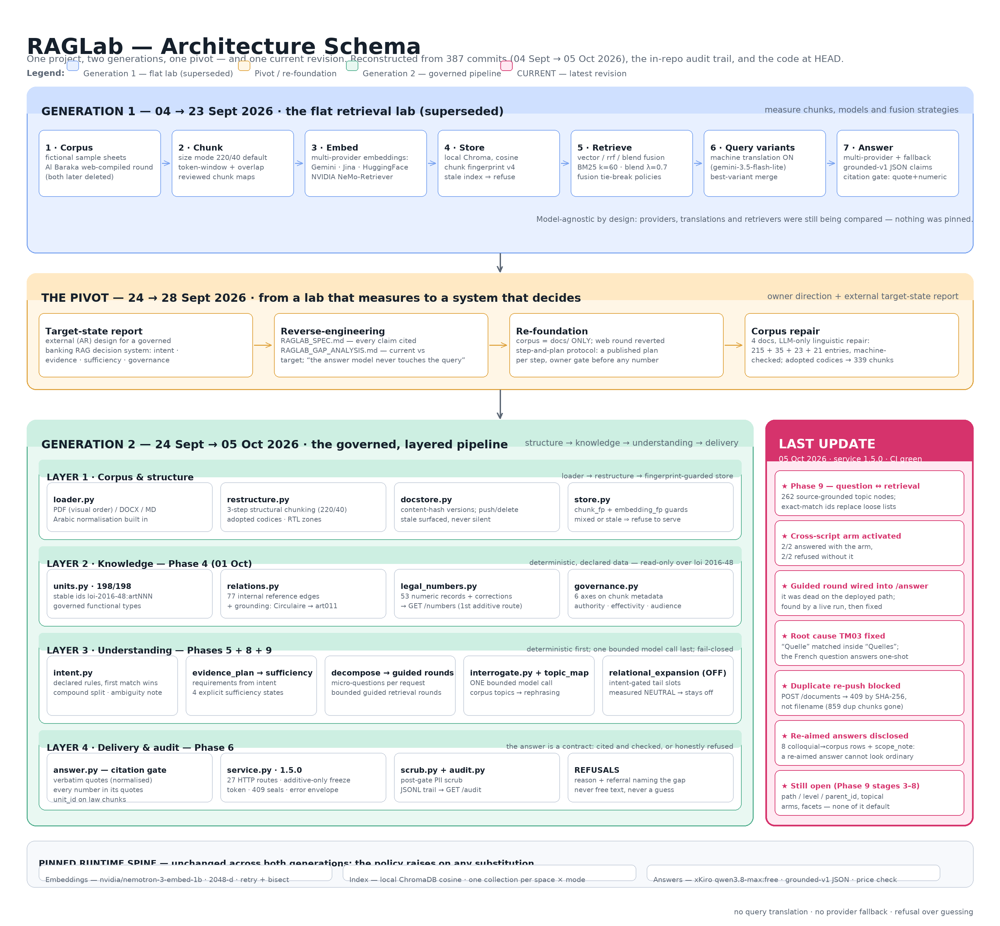
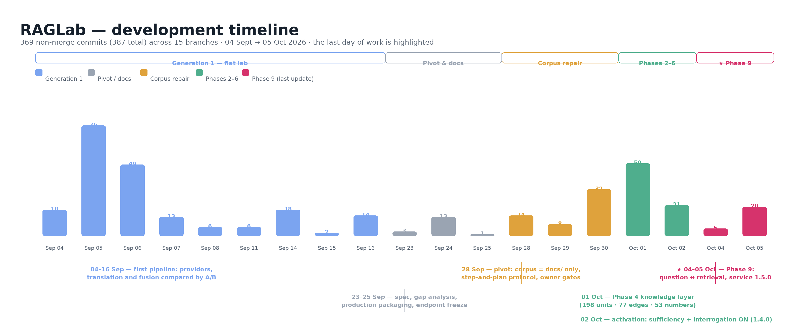

> **Version française du rapport de stage — corps du document.**
> Un *executive summary* en anglais ouvre le rapport (§0).
> Les champs à personnaliser sont indiqués dans le tableau de la section « Remplacement des champs » ci-dessous.

---

# Remplacement des champs (Ctrl+H)

Un seul jeton est à remplacer dans tout le document :

| Jeton | À remplacer par | Où il apparaît |
|---|---|---|
| `[[INTERN_NAME]]` | Le nom et prénom de l'étudiant(e) | Page de garde, en-tête de section, attestation finale |

Les autres champs portent déjà les valeurs retenues : **Al Baraka Bank** (entreprise d'accueil),
**du 1er août au 1er octobre 2026** (période), **Ahlem BENHADDOUD** (encadrante),
**École supérieure privée d'ingénierie et de technologie** (école), année universitaire **2025–2026**.
Pour les modifier, remplacez ces libellés directement dans les fichiers `INTERNSHIP_REPORT.md`,
`rapport_stage.tex` et `rapport_stage.pdf`.

Deux points d'attention avant tout dépôt du rapport :

1. Le document ne contient **aucun identifiant de compte, aucune adresse de dépôt ni aucun lien
   vers une forge logicielle** — volontairement. Si vous réintroduisez des captures d'écran ou des
   extraits de commandes, vérifiez qu'ils n'en font pas réapparaître.
2. Une case reste à compléter si nécessaire : les éléments d'entreprise du chapitre 1
   (année de création, effectif, secteur d'activité précis) sont volontairement génériques et
   signalés par `TODO-ENTREPRISE`.

---

## Résumé

Ce rapport rend compte d'un stage de fin d'études consacré à la conception, à la construction et
à l'évaluation de **RAGLab**, un système de question-réponse documentaire (RAG) appliqué à des
documents bancaires arabes. Le système répond uniquement à partir d'un corpus de quatre documents
réels, exige que chaque affirmation soit adossée à une citation **littérale** dont tous les
nombres figurent dans la source, et refuse de répondre — en expliquant ce qui manque — lorsque la
preuve est insuffisante. L'architecture a évolué en cours de projet : une première génération de
type laboratoire de recherche d'information (multi-fournisseurs, traduction de requêtes, fusion
lexicale) a été remplacée, après un pivot méthodologique, par une architecture en quatre couches
gouvernées — structure, connaissance, compréhension, livraison et audit. Les résultats mesurés
montrent l'apport du découpage structurel (+20 points de hit@1 par rapport au découpage à fenêtre
fixe : 51 → 71), la supériorité de la recherche dense sur la fusion BM25 sur ce corpus, un index
d'unités de connaissance à 100/100/100 sur les questions de loi, et un accord inter-modèles de
0,720 avec des citations identiques lorsque le contexte est fixé. Le rapport documente aussi les
limites du système, la méthode de mesure (jeux de questions gelés, portes d'activation, mesures
appariées) et la dernière évolution en date, qui a corrigé trois défauts d'exploitation invisibles
en test.

**Mots-clés :** RAG · recherche d'information · documents bancaires arabes · ancrage des
citations · suffisance de preuve · évaluation mesurée.

---

## 0. Executive summary (English)

**Context and objective.** This internship report documents the design, implementation and
measurement of **RAGLab**, a document-grounded question-answering system (Retrieval-Augmented
Generation) built for Arabic-language banking documents at Al Baraka Bank, Tunisia. The problem
is a familiar one in regulated environments: an assistant that answers questions about internal
and regulatory documents must never invent figures or rules, and must be able to show the exact
passage it relied on. The project therefore optimised for **traceability and honest refusal**
rather than for fluent prose.

**What was built.** The work went through two architectures. *Generation 1* was a flat retrieval
laboratory: several embedding providers, machine-translated query variants, three retrieval
modes (dense vectors, BM25 fusion, score blending) and a citation gate, all compared by measured
A/B runs. *The pivot* (24–28 September 2026) followed an external target-state report: the
corpus was reduced to the four real documents, every step became an owner-gated plan, and
*Generation 2* extended the pipeline with four explicit layers — corpus/structure, knowledge
(198 law units, 77 cross-references, 53 structured number records, governance axes),
understanding (intent, evidence plan, sufficiency, decomposition, bounded interrogation) and
delivery (citation gate, PII scrubbing, audit trail).

**Method.** Every architectural claim is backed by a measurement. The 50-case frozen question
set (verbatim / paraphrase / cross-lingual / out-of-scope) plus a 10-case target-category set are
re-measured on every candidate change, live runs are executed in CI against the real models, and
no default is changed without an owner gate and a documented rollback.

**Key results.** Structural chunking beats token-window chunking on the live vector arm
(hit@1/3/5: 51/64/71 → **71/80/87**); dense retrieval beats BM25 fusion and score blending on
the same set (71/80/87 vs 71/80/82 vs 62/80/84), so the vector arm stayed the default. The
knowledge layer's unit index answers the law questions perfectly (100/100/100 vs a 67/92/92
baseline). Model-independence measurements showed that with retrieval fixed, 72% of question
outcomes agree between two different answer models and cited sources are identical (Jaccard
1.000) whenever both answer. The final iteration (Phase 9) rebuilt the question-to-corpus topic
link, fixed a live defect that kept the guided retrieval round from running in the deployed
service, fixed a French intent-classification root cause, blocked duplicate document pushes by
content hash, and added explicit disclosure when an answer has been re-aimed — closing with a
green offline gate (463 tests + 121 checks) and a green container build.

**Limits.** The pipeline validates that quotes and numbers exist in the cited sources; it does
not prove that a claim is *entailed* by them. There is no similarity threshold, the service is a
single stateful worker, updates require re-ingestion, and the evaluation sets are small and
correlated. The repository itself states the system is **not production-ready for a banking
service** and is suitable only for a supervised pilot on approved non-confidential documents.

**Next steps.** Authentication and role-based filtering (Phase 7 decisions), chunk-level
topical metadata (`path`/`level`/`parent_id`), topical and lexical retrieval arms measured on
the same frozen sets, and a closing campaign that re-measures every arm before any new default.

---

## Sommaire

- [Introduction générale](#introduction-générale)
- [Chapitre 1 — Contexte et cadrage du projet](#chapitre-1--contexte-et-cadrage-du-projet)
- [Chapitre 2 — État de l'art et choix techniques](#chapitre-2--état-de-lart-et-choix-techniques)
- [Chapitre 3 — Architecture et implémentation](#chapitre-3--architecture-et-implémentation)
- [Chapitre 4 — Évaluation, résultats et limites](#chapitre-4--évaluation-résultats-et-limites)
- [Conclusion générale et perspectives](#conclusion-générale-et-perspectives)
- [Références internes au projet](#références-internes-au-projet)
- [Annexes](#annexes)

---

## Introduction générale

Les établissements bancaires produisent et consomment une masse de textes réglementaires et
procéduraux : lois, circulaires de la banque centrale, guides internes, supports de formation.
Retrouver une information fiable dans ces documents est un exercice coûteux, et le confier à un
modèle de langage « brut » est dangereux : un modèle génératif répond toujours, même lorsqu'il ne
sait pas, et rien ne distingue une phrase recopiée d'une phrase inventée.

Le stage dont ce rapport rend compte a porté sur la conception, la construction et l'évaluation
d'un système de **question-réponse documentaire** (RAG, *Retrieval-Augmented Generation*) sur un
corpus bancaire réel en langue arabe. Le projet, baptisé **RAGLab**, poursuit trois objectifs :

1. **Traçabilité.** Chaque affirmation de la réponse doit être adossée à un extrait littéral du
   document cité, et chaque nombre avancé doit figurer dans cet extrait.
2. **Refus honnête.** Quand la preuve manque, le système doit refuser de répondre — en expliquant
   ce qui manque — plutôt que de produire une réponse plausible.
3. **Mesure.** Aucun choix d'architecture (découpage, modèle, mode de recherche, seuil) n'est
   retenu sans une comparaison mesurée, reproductible, et un critère de décision explicite.

Le rapport suit le déroulement réel du travail. Le chapitre 1 présente le contexte, le problème
métier et la méthode de travail. Le chapitre 2 situe les choix techniques par rapport à l'état de
l'art du RAG. Le chapitre 3 décrit l'architecture — en montrant qu'elle a **changé en cours de
route** : une première génération de type « laboratoire de recherche d'information », puis un
pivot méthodologique, puis une seconde génération organisée en couches gouvernées, dont la
dernière évolution est mise en évidence. Le chapitre 4 présente les mesures, les résultats et
les limites. La conclusion dresse le bilan et les perspectives.

Une remarque de méthode, enfin : le projet a été développé sur un dépôt Git versionné, avec une
discipline de mesure et de revue constante. Les chiffres cités dans ce rapport sont tous
reproductibles à partir du dépôt ; leur provenance est indiquée en annexe B.

---

## Chapitre 1 — Contexte et cadrage du projet

### 1.1 L'entreprise d'accueil

Le stage s'est déroulé au sein d'**Al Baraka Bank**, banque islamique de la place tunisienne.
Ses activités et ses produits s'inscrivent dans le cadre de la **loi n° 2016-48 du 11 juillet
2016 relative aux banques et aux établissements financiers**, l'un des documents du corpus de ce
projet.

`TODO-ENTREPRISE` — compléter ici, si le rapport doit être déposé en l'état, les éléments
factuels d'entreprise (date de création, effectif, réseau d'agences, périmètre d'activité) à
partir des sources officielles de la banque.

**Environnement de travail.** Le projet a été mené dans un environnement de développement
individuel : Python 3.11, un dépôt Git, un service local conteneurisé, et une intégration
continue (GitHub Actions) utilisée à la fois comme porte de qualité et comme banc de mesure des
modèles réels. Deux contraintes matérielles ont structuré la méthode : l'absence d'accès réseau
vers les fournisseurs de modèles depuis le poste de développement (les mesures « live » sont
donc exécutées dans l'intégration continue), et l'absence de moyens de calcul GPU (d'où le
recours à des modèles servis par API).

### 1.2 Problématique métier

Le corpus réuni pour l'évaluation est composé de quatre documents réels, tous en arabe :

| Document | Nature | Rôle dans le corpus |
|---|---|---|
| Loi n° 2016-48 (11 juillet 2016) | Loi | Référence juridique supérieure (198 articles, 11 titres) |
| Circulaire BCT n° 2019-08 | Circulaire de la banque centrale | Cadrage opérationnel des opérations (20 chapitres) |
| Guide interne d'opérations bancaires islamiques | Guide interne | Politique et procédures internes de conformité |
| Introduction à la finance islamique (*Madkhal*) | Support de formation | Historique, définitions, ordres de grandeur |

Trois questions concrètes ont motivé le projet.

- **La question de l'utilisateur est rarement la question du document.** Un client ou un agent
  formule une demande en langage courant (« puis-je ouvrir un commerce ? ») là où le corpus
  contient des formulations techniques (`الصيغة`, `محل العقد`, `تمويل`). La réponse doit être
  retrouvée malgré cet écart lexical et syntaxique.
- **Le multilinguisme est asymétrique.** Le corpus est arabe, mais les questions arrivent aussi
  en français et en anglais ; une question française doit pouvoir s'appuyer sur un passage arabe
  sans jamais traduire l'utilisateur ni le document.
- **L'erreur est coûteuse.** Dans un contexte bancaire, une réponse fausse sur un taux, un délai
  ou une sanction n'est pas une simple imprécision : c'est un risque juridique.

### 1.3 Objectifs du stage

Les objectifs fixés en début de stage, et tenus tout au long du projet, étaient les suivants :

1. Construire une chaîne complète *chargement → découpage → vectorisation → indexation →
   recherche → génération ancrée → vérification* sur les documents réels.
2. Ne retenir que des modèles **libres d'accès** (offre gratuite) et reproductibles, en
   documentant les mesures comparatives plutôt que les impressions.
3. Faire du **refus explicite** un comportement de premier rang, avec une taxonomie de raisons.
4. Livrer le système sous forme de **service** intégré à l'application de la banque, avec un
   contrat HTTP stable, versionné et testé.
5. Instrumenter la qualité : tests hors ligne, intégration continue, jeux de questions gelés,
   journal d'audit.

### 1.4 Contraintes du projet

| Contrainte | Conséquence sur la méthode |
|---|---|
| Aucun accès réseau aux API de modèles depuis le poste | Les mesures sur modèles réels s'exécutent en CI, sur déclenchement explicite (coût maîtrisé) |
| Pas de GPU | Modèles servis par API, épinglés et versionnés |
| Corpus réel uniquement | Aucun corpus fictif dans le dépôt ; les jeux de tests sont gelés et versionnés |
| Service déjà en cours d'intégration | **Gel des points d'entrée HTTP** : toute évolution est additive, avec incrément de version |
| Exigence de traçabilité | Chaque chiffre publié est rattaché à un commit, un journal ou un identifiant d'exécution |

### 1.5 Méthode de travail

Le projet a suivi un protocole dit « **étape et plan** », adopté après le pivot du chapitre 3.
Chaque étape publie son propre plan, en huit points, avant d'écrire la moindre ligne de code :

1. l'objectif et le périmètre (ce que l'étape fait **et** ce qu'elle ne fait pas) ;
2. les entrées (fichiers, décisions, mesures antérieures) ;
3. les actions, numérotées et vérifiables une à une ;
4. les sorties (fichiers, rapports, chiffres nommés) ;
5. la vérification automatique (tests, CI, contrôles d'intégrité) ;
6. la façon dont le donneur d'ordre teste lui-même le résultat ;
7. le critère de passage à l'étape suivante ;
8. le point de retour (comment revenir en arrière).

Deux règles complètent ce protocole : la porte locale (compilation, contrôles hors ligne, tests
unitaires, inspection) doit être verte **avant** toute publication, et l'intégration continue
doit être surveillée jusqu'au vert **après**. Les jeux de questions sont gelés : une campagne de
mesure qui les modifierait serait invalidée.

Enfin, l'implémentation a été menée avec l'assistance d'un agent de codage, sous la forme d'un
**contrat de travail écrit** (`AGENTS.md`) qui consigne les contraintes, les faits vérifiés et
les pièges déjà rencontrés. Chaque étape reste soumise à une validation humaine : l'agent
propose, mesure et documente ; les décisions d'activation (valeurs par défaut, ouverture d'une
nouvelle phase) appartiennent au donneur d'ordre. Cette organisation s'est révélée décisive pour
la reproductibilité du travail : elle a permis de reprendre le projet après plusieurs
interruptions sans repartir de zéro, et d'éviter qu'un même défaut soit diagnostiqué deux fois.

---

## Chapitre 2 — État de l'art et choix techniques

### 2.1 Le principe du RAG et ses points de rupture

Un système RAG combine deux composants : un **système de recherche d'information** qui sélectionne
des extraits pertinents dans une base documentaire, et un **modèle de langage** qui rédige une
réponse à partir de ces extraits. Le raisonnement est simple : plutôt que d'espérer qu'un modèle
mémorise des faits, on lui fournit les passages utiles au moment de répondre.

Cette architecture déplace le problème plus qu'elle ne le résout. Les points de rupture sont
connus et ont structuré tout le projet :

| Point de rupture | Symptôme observé en pratique | Réponse apportée dans RAGLab |
|---|---|---|
| Découpage arbitraire | Une définition coupée en deux devient inutilisable | Découpage structurel (chapitre 3, §3.4.1) |
| Écart lexical | La question dit « murabaha », le document dit « المرابحة » | Normalisation arabe partagée, ponts inter-systèmes d'écriture, interrogation bornée |
| Faux positifs de similarité | Les 5 extraits remontés sont hors sujet, mais rien ne le signale | État de suffisance déterministe, refus explicite |
| Hallucination | Une phrase correcte énonce un chiffre inventé | Contrôle des citations **et** des nombres (§3.4.4) |
| Perte de traçabilité | Impossible de vérifier ce que le modèle a lu | Citations littérales, identifiants de fragments, journal d'audit |
| Régressions silencieuses | Une amélioration locale dégrade un autre cas | Jeux de questions gelés, mesures comparatives appariées |

### 2.2 Le découpage : du « token-window » au découpage structurel

La littérature distingue deux familles. Le **découpage à fenêtre fixe** coupe le texte tous les
`N` tokens avec un recouvrement ; il est simple, uniforme, et aveugle à la structure. Le
**découpage structurel ou sémantique** respecte les frontières du document (titres, articles,
paragraphes, tableaux) ; il produit des unités de sens, au prix d'une analyse préalable.

Le projet a implémenté les deux, puis les a mesurés. Le mode historique `size` (220 tokens, 40 de
recouvrement) reste disponible ; le mode `restructure`, devenu la valeur par défaut, met en
œuvre un enchaînement en trois étapes proposé et validé par le donneur d'ordre :

1. **Normalisation sémantique** — nettoyage des en-têtes de gazette, suppression des en-têtes
   répétés, extraction des marqueurs de section (`الفصل`, `العنوان`, `الباب`), reconstruction de
   l'ordre visuel des lignes arabes issues des PDF.
2. **Enrichissement par fil d'Ariane** — injection, au-dessus de chaque sous-titre et de chaque
   tableau, d'une ligne de contexte `h1 > h2 > h3`.
3. **Découpage structurel récursif** — séparation selon une hiérarchie de séparateurs
   (`\n# `, `\n## `, `\n### `, `\n\n`, `\n`, ` `) au budget habituel de 220/40 tokens.

À cela s'ajoute une étape de **réparation linguistique** des textes extraits (voir §3.4.1) : les
PDF de textes juridiques arabes ressortent en ordre visuel avec des chiffres corrompus, ce qui
rend le corpus inutilisable en l'état.

### 2.3 Les représentations vectorielles

Les modèles d'*embeddings* multilingues projettent un texte dans un espace où la proximité
traduit la proximité de sens. Pour l'arabe, deux difficultés dominent : la morphologie riche
(préfixes, suffixes, formes définies) et la coexistence de plusieurs systèmes d'écriture dans les
mêmes questions (les utilisateurs écrivent souvent les termes techniques en caractères latins).

Le projet a comparé plusieurs fournisseurs — Google, Jina, HuggingFace, NVIDIA — avant de
**fixer** le couple retenu : `nvidia/nemotron-3-embed-1b`, en dimension native 2048. Ce choix
fige l'espace vectoriel, ce qui autorise une vérification forte : chaque index stocke une
**empreinte** du modèle et du découpage qui l'a produit, et une recherche qui ne correspondrait
pas à cette empreinte est refusée avant tout appel de modèle.

### 2.4 La recherche : dense, lexicale, hybride

Trois stratégies ont été implémentées et mesurées :

- **vectorielle (dense)** — similarité cosinus sur les vecteurs ;
- **RRF** — fusion par rang réciproque (constante 60) entre la recherche dense et un index
  lexical BM25 (k1 = 1,5 ; b = 0,75) ;
- **blend** — fusion par score, `λ·cosinus + (1−λ)·BM25 normalisé`, λ = 0,7.

La mesure a tranché (§4.4) : sur le corpus arabe et le jeu gelé, la fusion lexicale n'apporte pas
de gain net et **dégrade le français**. Le mode dense reste donc la valeur par défaut, les deux
autres restant accessibles comme options explicites.

### 2.5 L'ancrage : contrôle des citations et suffisance

La contribution la plus significative du projet n'est pas la recherche mais la **vérification**.
Le modèle ne renvoie pas du texte libre : il doit produire un objet JSON de type `grounded-v1`,
où chaque affirmation porte une ou plusieurs preuves, chacune étant une citation **littérale**
d'un extrait fourni. Trois contrôles déterministes s'appliquent ensuite :

1. **Appartenance des citations** — après normalisation (arabe, casse, espaces), chaque citation
   doit être une sous-chaîne de l'extrait cité.
2. **Contrôle numérique** — tout nombre en chiffres présent dans une affirmation doit apparaître
   dans ses citations, en tenant compte des séparateurs de milliers et des chiffres
   arabo-indiens.
3. **Contrôle de politique** — la source citée doit avoir été réellement récupérée, appartenir
   aux documents autorisés et, lorsque l'axe de vigueur est renseigné, être en vigueur.

En amont de la génération, une couche déterministe de **suffisance** confronte le besoin de
preuve (dérivé de l'intention de la question) au contenu réellement récupéré et produit quatre
états : suffisant, insuffisant, contradictoire, indéterminé. C'est cet état — et non un score de
similarité — qui décide si le système répond, refuse, ou tente une seule réinterprétation bornée.

### 2.6 L'évaluation

Le projet mesure la **retrouvabilité** (hit@1, hit@3, hit@5 : le document et l'extrait attendus
apparaissent-ils dans les k premiers résultats) et le **comportement final** (réponse ancrée,
refus motivé). Deux jeux de questions gelés servent de référence :

- `questions_50.json` — 50 cas : 10 verbatim, 20 paraphrases, 15 transfrontaliers (6 français,
  9 anglais) et 5 hors périmètre (qui ne doivent produire aucune correspondance) ; langues :
  32 arabe, 8 français, 10 anglais ;
- `questions_targets.json` — 10 cas arabes couvrant cinq catégories cibles : langage familier,
  synonymes, demande implicite, demande composée, ambiguïté.

Trois règles de mesure rendent les comparaisons défendables : les chiffres comparés sont mesurés
**dans la même exécution** ; les comparaisons inter-exécutions sont annoncées avec une tolérance
de ±2 points (les modèles servis ne sont pas bit-reproductibles) ; et un jeu gelé n'est jamais
modifié pour améliorer un résultat.

### 2.7 Les modèles retenus

Une comparaison mesurée de modèles gratuits (13 vérifications de développement, 18 vérifications
en aveugle, 3 scénarios d'injection) a conduit à figer un couple unique :

| Rôle | Fournisseur / modèle | Justification |
|---|---|---|
| Vectorisation | NVIDIA `nemotron-3-embed-1b` (2048 dimensions) | Qualité mesurée sur le corpus arabe, dimension native élevée, mise en cache possible |
| Réponse | xKiro `qwen/qwen3.8-max:free` | Meilleur taux de citations conformes au contrat `grounded-v1`, contrôle de prix en direct |

Deux décisions renforcent la reproductibilité : **aucun repli** n'est autorisé (un modèle
différent provoque une erreur explicite, pas une dégradation silencieuse) et la traduction
automatique des requêtes est **retirée** (elle reste mesurée et documentée comme historique).

### 2.8 L'écosystème technique

Le projet assume un choix de sobriété, argumenté à chaque fois qu'il l'a été :

| Brique | Choix | Alternative écartée |
|---|---|---|
| Orchestration | Code Python explicite (`raglab/*.py`) | LangChain / LlamaIndex : boîte noire, dépendances lourdes |
| Base vectorielle | ChromaDB local, persistant, cosinus | Base vectorielle cloud : coût, données bancaires |
| Appels HTTP | `urllib` de la bibliothèque standard | SDK fournisseurs : dépendances, rétrocompatibilité |
| Service | FastAPI + uvicorn | — |
| Découpage | `tiktoken` (`cl100k_base`) avec estimation de repli | — |
| PDF / DOCX | `pypdf` ; lecture directe OOXML | SDK bureautiques |
| Tests / CI | `unittest` + GitHub Actions (7 scénarios) | — |

Le dépôt ne contient **ni framework d'orchestration, ni base vectorielle externe, ni SDK de
fournisseur** : cette contrainte facilite l'audit (tout le comportement est lisible) et
l'exploitation chez un hébergeur interne.

---

## Chapitre 3 — Architecture et implémentation

### 3.1 Vue d'ensemble : deux générations et un pivot

> **Figures.** Le schéma complet est fourni dans trois formats joints :
> `architecture_schema.svg` (vectoriel, imprimable), `architecture_schema.png` (image), et
> `timeline.png` (chronologie du développement, 369 commits).
> Dans la version LaTeX, les deux figures sont incluses aux emplacements indiqués.



*Figure 1 — Schéma d'architecture : la génération 1 (laboratoire plat), le pivot, la génération 2
en quatre couches, et l'encadré « LAST UPDATE » qui isole la dernière évolution.*



*Figure 2 — Chronologie : 369 commits répartis sur 19 journées de travail ; la dernière journée
(04–05 octobre) est mise en évidence.*


L'architecture du système a **changé en profondeur au milieu du projet**. Le schéma complet
figure dans le document joint `architecture_schema.svg` (et `architecture_schema.png`) ; on en
retient ici la structure :

```
Génération 1 (04 → 23 sept.)   pipeline plat, multi-fournisseurs, traduction, fusion
       ↓  pivot 24 → 28 sept.  rapport cible → analyse d'écart → refondation sur docs/
Génération 2 (24 sept. → 05 oct.)   quatre couches gouvernées
       ↓  dernière évolution   Phase 9 — lien question ↔ corpus (service 1.5.0)   ← état actuel
```

Le moteur commun aux deux générations est inchangé et volontairement figé : vectorisation
NVIDIA, index Chroma local en cosinus, génération par le modèle épinglé, contrôle des citations.
Ce qui a changé, c'est **ce qui entoure** ce moteur : la nature du corpus, la manière de
découper, et surtout l'ajout de couches explicites de connaissance, de compréhension et de
traçabilité.

### 3.2 Génération 1 — le laboratoire de recherche d'information

La première génération est un pipeline linéaire, orienté comparaison :

1. **Corpus** — des feuilles de test fictives puis un corpus compilé depuis le web, en plus des
   documents réels.
2. **Découpage** — mode `size` par défaut (220/40), cartes de découpage revues manuellement
   (`manual`), et introduction du mode `restructure`.
3. **Vectorisation** — plusieurs fournisseurs comparés en A/B (Google, Jina, HuggingFace,
   NVIDIA), avec validation stricte (rejet des vecteurs non finis ou nuls) et mise en cache.
4. **Indexation** — ChromaDB local, une collection par espace vectoriel, empreinte de découpage.
5. **Recherche** — modes `vector`, `rrf`, `blend`, politiques de départage testées en CI.
6. **Variantes de requête** — traduction automatique de la question (modèle `gemini-3.5-flash-lite`),
   puis fusion des variantes (« best-variant merge »).
7. **Réponse** — plusieurs fournisseurs avec chaîne de repli, contrat JSON `grounded-v1`,
   contrôle des citations.

**Pourquoi elle a été remplacée.** Cette génération répondait à une question de mesure
(« quel découpage, quel modèle, quelle fusion gagne ? ») mais pas à la question du donneur
d'ordre, apparue avec le rapport cible : « le système peut-il **décider** — citer, douter,
refuser, tracer ? » Aucun réglage de recherche ne peut produire une notion de suffisance, des
unités de connaissance stables ou un journal d'audit. C'est ce constat qui a déclenché le pivot.

### 3.3 Le pivot (24 → 28 septembre 2026)

Le pivot s'est déroulé en quatre temps, tous documentés dans le dépôt.

1. **Spécification inversée.** Un document de spécification technique a été produit par
   investigation statique du code : chaque affirmation y est citée (fichier, symbole, ligne) et
   étiquetée *observé*, *déduit* ou *inconnu*. Il a servi de base factuelle à toute la suite.
2. **Analyse d'écart.** Le rapport cible (externe, en arabe) a été confronté à cette
   spécification. Conclusion en deux volets : le système était **en avance** sur certaines
   hypothèses (contrôle des citations, taxonomie de refus, refus de servir un index périmé) et
   **en retard** sur d'autres (intention, plan de preuve, suffisance, gouvernance documentaire,
   journal d'audit, identifiants d'unité stables).
3. **Refondation sur le corpus réel.** Décision du donneur d'ordre : le corpus de travail est
   constitué **uniquement** des quatre documents réels ; la campagne compilée depuis le web a été
   intégralement retirée. Le protocole « étape et plan » est adopté à cette date.
4. **Réparation du corpus.** Les quatre documents ont été corrigés par voie linguistique
   uniquement (aucune reconstruction algorithmique) : 215 corrections pour la loi (29 lots),
   35 pour la circulaire (dont les 28 nombres corrompus), 23 pour le guide (numérotation
   hiérarchique inversée) et 21 pour le support de formation. Chaque journal de réparation est
   vérifié automatiquement (fidélité au texte source, conservation, couverture) et chaque
   document a été adopté par le donneur d'ordre. Le corpus d'évaluation compte dès lors
   **339 fragments** : 233 (loi), 54 (guide), 39 (support), 13 (circulaire).

### 3.4 Génération 2 — l'architecture en couches

#### 3.4.1 Couche 1 — corpus et structure

| Module | Rôle |
|---|---|
| `loader.py` | Lecture PDF/DOCX/MD, normalisation arabe (NFKC, réparation des formes de présentation, unification des alif, suppression du tatweel et des diacritiques), détection de langue |
| `restructure.py` | Découpage structurel en trois étapes (§2.2) ; réparation de l'ordre visuel par reconstruction de zones ; adoption des textes corrigés |
| `chunker.py` | Découpage historique `size` (220/40) ; empreinte de découpage (version 4) encodant mode, taille, recouvrement et tokenizer |
| `docstore.py` | Dépôt de documents poussés par l'application, versionné par empreinte SHA-256 : même contenu = sans effet, contenu différent = nouvelle version, index marqué « périmé » jusqu'à la prochaine indexation |
| `store.py` | ChromaDB local (cosinus), index lexical BM25, fusion RRF/blend, refus de servir un index incohérent, purge par source |

Deux garde-fous structurent cette couche. D'abord, **l'index est auto-descriptif** : chaque
fragment porte l'empreinte du découpage et de l'espace vectoriel qui l'ont produit ; une
recherche sur un index périmé est refusée avec la marche à suivre (réindexation). Ensuite, un
**verrou d'indexation** : pendant une indexation, toutes les lectures d'index renvoient un
conflit explicite (409) plutôt que de risquer une lecture incohérente.

#### 3.4.2 Couche 2 — la couche de connaissance

Cette couche, construite sur la loi 2016-48 (document choisi par le donneur d'ordre), est
**déterministe et déclarative** : les données sont des fichiers versionnés, validés par des
contrôles automatiques, et **révisables ligne à ligne**.

| Élément | Contenu | Contrôle |
|---|---|---|
| Unités de connaissance | 198 unités (= les 198 articles), texte littéral, identifiant stable `loi-2016-48:artNNN`, chemin hiérarchique `العنوان > الباب > الفصل`, type fonctionnel gouverné | Couverture 198/198, littéralité du texte, stabilité des identifiants |
| Relations | 77 références internes (« le présent article »…) + 1 relation d'ancrage (circulaire → article 11) | Preuve littérale obligatoire, cibles existantes |
| Chiffres structurés | 53 enregistrements (14 taux, 28 délais, 5 plafonds, 6 sanctions) + table de corrections (15 lignes) ; servis par un point d'entrée dédié `GET /numbers` | Chaque valeur brute présente littéralement dans son unité |
| Gouvernance | 6 axes (autorité, vigueur, portée, public, domaine, source) écrits dans les métadonnées des fragments | Cohérence registre ↔ corpus |
| Index d'unités | Les 198 lignes descriptives sont indexées dans une collection isolée, comme surface de recherche supplémentaire | Mesuré en direct : 100/100/100 contre 67/92/92 (§4.6) |

L'ajout du point d'entrée `GET /numbers` est significatif : c'est la **première extension
autorisée** sous le gel des points d'entrée, et elle a été conçue comme strictement additive —
lecture seule, filtrable, fonctionnant même sur un index vide, sans modifier aucun point
d'entrée existant.

#### 3.4.3 Couche 3 — la compréhension de la demande

C'est la couche la plus récente et la plus discutée. Sa règle fondatrice : **déterministe
d'abord, modèle ensuite, et jamais deux fois**.

| Module | Fonction | État |
|---|---|---|
| `intent.py` | Classification de l'intention par règles déclarées (première règle qui s'applique), découpage des demandes composées, détection d'ambiguïté influente | Actif (lecture seule) |
| `evidence_plan.py` | Dérive de l'intention les **exigences de preuve** (ce qui doit être présent pour pouvoir répondre) — jamais la réponse | Actif |
| `sufficiency.py` | Confronte plan et fragments récupérés ; produit l'état de suffisance, détecte les contradictions, propose des tours de recherche guidés bornés | Actif (champs exposés) |
| `decompose.py` | Décompose chaque question en micro-questions, chacune avec son exigence unique | Construit, non câblé |
| `interrogate.py` + `topic_map.py` | Si — et seulement si — rien n'est couvert : **un appel borné** au modèle, qui transforme la demande pratique en question technique, en choisissant les sujets dans une carte dérivée du corpus | **Actif par défaut** (décision du donneur d'ordre) |
| `relational_expansion.py` | Élargit la recherche le long des relations, en queue de liste | Désactivé (mesuré neutre) |
| `micro_retrieval.py` | Recherche par micro-question + fusion | Désactivé (mesuré défavorable) |

Les garanties de l'interrogation méritent d'être soulignées, car elles expliquent son acceptation :
**échec fermé** (sortie mal formée, sujet inventé, exigence inventée ou reformulation identique à
la question ⇒ refus normal), **divulgation complète** (les champs `understood_as`,
`original_question` et `interrogation` accompagnent la réponse), et **coût visible** (la durée de
l'appel d'interrogation est exposée séparément).

#### 3.4.4 Couche 4 — livraison et audit

- **Invite de génération** (`grounded-v1`) : la question et les extraits sont déclarés comme
  données non fiables ; le modèle n'a ni compte, ni données vivantes, ni capacité d'action ;
  la sortie est un objet JSON strict (affirmations + preuves), sans prose libre.
- **Contrôle des citations** : appartenance des citations, contrôle numérique, contrôle de
  politique (source récupérée, document autorisé, document en vigueur). Les fragments de loi
  cités portent en outre l'identifiant d'unité stable, ce qui permet de citer un article de
  manière durable, indépendamment du découpage.
- **Engagement de suffisance** : si rien n'est couvert, le service refuse **avant** tout appel
  de génération, avec une référence nommant les exigences manquantes ; si la couverture est
  partielle, une seule régénération bornée est autorisée.
- **Assainissement** : les données personnelles reconnaissables (courriel, téléphone, RIB/IBAN
  tunisien, CIN) sont remplacées par des étiquettes **après** le contrôle des citations.
- **Journal d'audit** : chaque requête laisse une trace JSONL (identifiant de trace, horodatage,
  question assainie, statut, état de suffisance, modèle, compteurs, latence), exposée par
  `GET /audit` avec une rétention bornée.

#### 3.4.5 Le cycle d'une requête

```
Question (ar / fr / en)
  → authentification, court-circuit de salutation, verrou d'indexation
  → intention → plan de preuve
  → recherche dense sur la question ORIGINALE (jamais traduite), top 5
  → suffisance sur les fragments récupérés
       ├─ suffisant  → génération directe (zéro appel supplémentaire)
       ├─ partiel    → une seule régénération bornée sur les points couverts
       └─ rien       → UN appel d'interrogation borné → nouvelle recherche → même contrôle
  → construction du contexte (budget 3000 tokens ; un extrait tronqué est écarté, jamais coupé)
  → génération JSON ancrée → contrôle des citations → assainissement → journal
  → réponse citée, ou refus motivé (les deux sont des réponses valides)
```

#### 3.4.6 Portes et valeurs par défaut

Toutes les briques expérimentales sont placées derrière des **portes** explicites, ce qui permet
de mesurer sans engager l'exploitation. Les portes actuelles sont : assemblage du contexte,
champs de suffisance (activés), engagement de suffisance (activé), interrogation (activée),
vocabulaire de concepts et ponts inter-systèmes d'écriture (activés à l'issue de la dernière
campagne), expansion relationnelle et recherche par micro-question (désactivées par la mesure).
Chaque porte désactivée restaure le comportement antérieur **octet pour octet**, ce qui est
vérifié par un test dédié.

### 3.5 Le service et les interfaces

Le système est exposé comme un **service HTTP unique** (FastAPI/uvicorn), volontairement
« un seul processus » : un profil actif, un index, une indexation à la fois.

| Aspect | Mise en œuvre |
|---|---|
| Points d'entrée | 27 routes : santé et état, profil et modèles, clés, inspection, fragments, indexation, recherche, réponse, évaluation, documents, diagnostics, audit, chiffres |
| Version | `SERVICE_VERSION = 1.5.0`, incrémentée à chaque changement de service |
| Contrat | Document de contrat humain (comportements, états, erreurs) + schéma OpenAPI généré ; en cas de divergence, OpenAPI fait foi pour les champs, le document pour les comportements |
| Authentification | Jeton partagé (`X-Service-Token`), comparaison à temps constant ; le service est prévu pour rester derrière la passerelle de l'application |
| Erreurs | Enveloppe unique `{"detail": {"reason": …, …}}`, raisons stables, valeurs sensibles filtrées |
| Gel | Aucun point d'entrée existant ne change (chemin, méthode, schéma) ; les évolutions sont additives |
| Intégration | Trois faces : CLI (`main.py`), console locale (`app.py`), console HTTP (`local_front.py`) — cette dernière servant de banc d'essai d'intégration pour l'application |

Le service est livré avec un `Dockerfile` et un `docker-compose.yml` (volumes pour l'index, le
cache de vectorisation et les documents poussés), et son intégration est documentée pour l'équipe
applicative : contrat HTTP, guide de requêtes exactes pour les écrans de réglages, maquette
d'interface, et guide de déploiement.

### 3.6 ★ La dernière évolution (Phase 9, 05 octobre 2026)

C'est l'état **actuel** du système, et il doit être lu comme tel : les sections précédentes
décrivent la trajectoire, celle-ci décrit le point d'arrivée.

**Le problème visé.** La carte des sujets utilisée par l'interrogation était dérivée des seuls
titres de sections. Elle contenait des entrées sans substance (« الفصل 12 ») et ne garantissait
pas que le sujet choisi corresponde au corpus réellement interrogeable. La Phase 9 corrige ce
**lien entre la question et l'espace des sujets**.

**Ce qui a changé :**

1. **Carte de sujets reconstruite** — 262 nœuds adossés aux sources (198 unités de loi +
   20 chapitres de la circulaire), chacun avec identifiant, chemin et extrait ; l'interrogation
   reçoit des identifiants à correspondance exacte au lieu de listes de titres. Le service passe
   en version 1.5.0 sans modifier la forme des réponses.
2. **Mesures dédiées** — une campagne de recherche seule sur sept cas porteurs de preuve
   (hit@1/3/5 = 5/7 en mode dense), puis une comparaison en direct de la carte des sujets
   (12 appels, tous correctement analysés, 4/5 → 5/5 de sujets cibles atteints), puis un sondage
   de bout en bout sur `POST /answer` : 3 réponses ancrées, 3 refus, toutes les réponses
   générées validées, zéro erreur de fournisseur. L'augmentation du nombre de fragments
   récupérés (5 → 12 → 20) ne change aucun résultat.
3. **Corrections issues de l'exploitation réelle** (chacune trouvée par une mesure, pas par
   intuition) :
   - **le tour guidé ne s'exécutait jamais dans le service déployé** — l'appel au contrôle de
     suffisance y était fait sans fonction de recherche ; le défaut n'apparaissait que sur le
     service réel, jamais dans le banc de test ;
   - **cause racine d'une erreur d'intention en français** — le motif `Quelle` s'appliquait à
     l'intérieur du mot `Quelles`, classant une question procédurale comme définitionnelle ; les
     marqueurs procéduraux français ont été ajoutés et ancrés ;
   - **doublons d'indexation bloqués** — une poussée de document identique à un document du
     corpus est désormais refusée par empreinte SHA-256 (et non par nom), ce qui a mis fin à un
     gonflement de l'index (859 fragments dupliqués chez le donneur d'ordre) ;
   - **divulgation des réponses réorientées** — un vocabulaire de concepts (8 lignes
     familier → terme du corpus), plus deux champs additifs (`scope_note`,
     `answered_reaimed_question`), signalent qu'une réponse a été produite après
     réinterprétation de la demande.
4. **État vérifié** — porte hors ligne verte (463 tests unitaires + 121 contrôles, compilation
   incluse), intégration continue verte (suite hors ligne + construction et import de l'image
   conteneur), jeux de questions et index de production inchangés.

**Ce qui reste ouvert** (et n'est engagé par aucun défaut) : l'ajout de métadonnées topiques aux
fragments (`path`, `level`, `parent_id`), les bras de recherche topique et leur mesure, les
facettes de vocabulaire, et la campagne de mesure finale. La règle reste : pas de changement de
valeur par défaut sans mesure préalable.

### 3.7 Ingénierie de la qualité

| Dispositif | Contenu |
|---|---|
| Tests hors ligne | 463 tests unitaires (pipeline, harnais, service) + 121 contrôles déterministes + compilation + inspection + vérification des dépendances |
| Intégration continue | 7 scénarios : porte principale à chaque poussée, suite « modèles réels » sur déclenchement manuel (coût maîtrisé), harnais lourd, catalogues de fournisseurs, juge de recherche, A/B de réponses, tests réels par étiquette |
| Portes de qualité | Empreintes d'index, refus de service pendant l'indexation, absence de repli de modèle, refus avant génération, échec fermé de l'interrogation |
| Reproductibilité | Caches de vectorisation et de réponses adressés par empreinte ; exécutions de mesure archivées ; chiffres rattachés à un commit et à un identifiant d'exécution |
| Documentation | Contrat, guide de requêtes, maquette d'interface, guide de déploiement, contrat de travail pour les sessions suivantes |

---

## Chapitre 4 — Évaluation, résultats et limites

### 4.1 Corpus et jeux de questions

Le corpus d'évaluation est celui décrit au §3.3 : quatre documents réels, réparés puis adoptés,
soit **339 fragments** sur le bras structurel (le découpage réellement obtenu en intégration
continue, avec le tokenizer complet, en produit 858 ; c'est cette différence, propre au
tokenizer, qui explique que certains contrôles soient exprimés en parts et non en nombres
absolus).

| Jeu | Taille | Composition |
|---|---|---|
| `questions_50.json` | 50 cas (45 évaluables + 5 hors périmètre) | 10 verbatim, 20 paraphrases, 15 transfrontaliers (6 fr, 9 en) ; 32 ar / 8 fr / 10 en |
| `questions_targets.json` | 10 cas arabes | 2 par catégorie : familier, synonymes, implicite, composé, ambigu |

Chaque sous-chaîne attendue a été vérifiée automatiquement : présence littérale dans le document
attendu **et** caractère distinctif dans le corpus (les concepts partagés entre documents, comme
la murabaha, portent une preuve propre à chaque document). La répartition par document est de
12 cas pour la loi, 10 pour la circulaire, 11 pour le guide et 12 pour le support de formation.

### 4.2 Protocole de mesure

- **Comparaison appariée** : les deux bras comparés sont mesurés dans la même exécution.
- **Tolérance** : ±2 points pour toute comparaison inter-exécutions (les modèles servis ne sont
  pas bit-reproductibles).
- **Deux étages** : un étage *hors ligne* (BM25 seul, déterministe, gratuit) qui sert de filtre
  rapide, et un étage *live* (vectorisation et modèles réels) qui tranche.
- **Comportement final** : au-delà de hit@k, on mesure le statut (réponse ancrée / refus) et la
  conformité des citations.

### 4.3 Découpage : fenêtre fixe contre structurel

Mesure hors ligne (BM25 seul, k = 20), sur le jeu de 50 cas :

| Bras | hit@1 | hit@3 | hit@5 |
|---|---|---|---|
| `size` 220/40 | 42 | 60 | 62 |
| `restructure` (corpus réparé adopté) | **62** | **82** | **87** |

Par langue : arabe 43/57/60 → 67/87/93 ; anglais 44/89/89 → 67/100/100 ; français inchangé
(33/33/33), plafond lexical que seul l'étage vectoriel pouvait franchir.

Mesure **live** (vectorisation réelle, modèles réels, même jeu) :

| Bras | hit@1 | hit@3 | hit@5 |
|---|---|---|---|
| `size` | 51 | 64 | 71 |
| `restructure` | **71** | **80** | **87** |

Le gain est net et reproductible : **+20 points de hit@1**. Les cas manqués par le bras
vectoriel sont, de façon complémentaire, retrouvés par le bras lexical — observation qui a
motivé l'essai d'un réordonnanceur déterministe, activé par défaut après mesure.

### 4.4 Modes de recherche : la fusion ne paie pas

Sur le bras structurel, en mesure live :

| Mode | hit@1 | hit@3 | hit@5 | Lecture |
|---|---|---|---|---|
| `vector` | **71** | 80 | **87** | retenu par défaut |
| `rrf` (BM25 fusionné) | 71 | 80 | 82 | égal en tête, en retrait en rappel |
| `blend` (λ = 0,7) | 62 | 80 | 84 | en retrait en tête |

En français, l'écart est plus marqué : le mode dense obtient 50/67/67, contre 33/33/50 pour RRF
et 33/33/67 pour le blend. La règle de décision retenue (« ne changer de défaut que si le
nouveau mode gagne **sans** régression sur les cas verbatim et hors périmètre ») conduit donc à
conserver le mode dense, tout en gardant les deux autres accessibles comme options explicites et
la décision révisable sur de nouvelles données.

### 4.5 Indépendance du modèle de réponse

Une campagne a mesuré deux modèles de réponse sur **une recherche identique** (mêmes fragments,
même question) :

| Modèle | Réponses | Refus | Erreurs fournisseur | Refus par le contrôle des citations |
|---|---|---|---|---|
| `qwen/qwen3.8-max:free` (retenu) | 37 | 13 | 0 | 7 |
| `moonshotai/kimi-k3` (comparaison) | 27 | 14 | 9 | 7 |

Accord de statut entre les deux modèles : **0,720**. Surtout, lorsque les deux modèles
répondent, les sources citées sont **identiques** (similarité de Jaccard = 1,000) : à contexte
fixé, la divergence entre modèles porte sur l'acceptation ou le refus, pas sur les citations.
Ce résultat conforte un choix d'architecture — la recherche est indépendante du modèle de
réponse, puisque le modèle ne voit jamais la question sous forme de requête — et déplace le
travail restant vers la complétude des preuves.

### 4.6 La couche de connaissance

**Index d'unités** — les 198 lignes descriptives des articles, indexées dans une collection
isolée et jugées par la même règle de comparaison que le bras de référence, sur les 12 questions
portant sur la loi :

| Bras | hit@1 | hit@3 | hit@5 |
|---|---|---|---|
| Référence (découpage structurel) | 67 | 92 | 92 |
| Index d'unités | **100** | **100** | **100** |

Chaque question de loi, y compris les questions transfrontalières, trouve son article au rang 1
sur la surface descriptive.

**Catégories cibles** — mesure live du jeu de 10 cas arabes :

| Catégorie | hit@1 / 3 / 5 | Lecture |
|---|---|---|
| Demande composée | 100 / 100 / 100 | bien couverte |
| Implicite et ambiguë | 50 / 100 / 100 | le second tour de recherche rattrape |
| Synonymes | 50 / 50 / 50 | partiellement couverte |
| Langage familier | 0 / 0 / 0 | lacune documentée, traitée par la couche de compréhension |

L'activation d'un lexique institutionnel de 16 entrées (abrégé, équivalents, familier → formel)
n'apporte **rien** sur le bras vectoriel, alors qu'il améliorait le bras lexical : ce résultat a
conduit à laisser le lexique désactivé, décision documentée et révisable.

### 4.7 ★ La dernière campagne (Phase 9)

| Mesure | Résultat |
|---|---|
| Recherche seule, 7 cas porteurs de preuve | hit@1/3/5 = 5/7 (mode dense) |
| Comparaison de la carte des sujets, 12 appels réels | 12/12 analysés sans erreur ; sujets cibles atteints 4/5 → **5/5** |
| Sondage de bout en bout, 6 questions inchangées | **3 réponses ancrées / 3 refus**, toutes les réponses générées validées, 0 erreur fournisseur |
| Effet du nombre de fragments (5 → 12 → 20) | aucun changement de résultat |
| Défaut découvert et corrigé | le tour guidé ne s'exécutait pas dans le service déployé |
| Cause racine corrigée | `Quelle` reconnu à l'intérieur de `Quelles` (classification d'intention en français) |
| Doublons | poussée identique refusée par SHA-256 (859 fragments dupliqués constatés chez le donneur d'ordre) |
| État final | porte verte : 463 tests + 121 contrôles ; CI verte ; jeux et index de production inchangés |

Leçon méthodologique de cette campagne : **les trois défauts les plus coûteux n'ont été trouvés
que par une exécution réelle**, jamais par la suite de tests — un banc de test ne mesure que ce
qu'il simule. C'est ce qui justifie la règle adoptée en fin de stage : toute affirmation portant
sur le service déployé doit être vérifiée sur le service déployé.

### 4.8 Robustesse

Six scénarios adversariaux sont vérifiés automatiquement contre le contrôle des citations :
citation fabriquée, citation empruntée à une autre source, nombre calculé (« 12 % de 1000 »),
identifiant de citation inconnu, marqueur de citation dans le texte de l'affirmation, et
injection d'instruction dans la question ou dans un extrait. Tous sont refusés par le contrôle
déterministe. Une limite est assumée et documentée : le contrôle garantit que les mots et les
nombres proviennent bien de la source, **pas** que l'affirmation en découle logiquement
(absence de vérification d'implication sémantique).

D'autres défauts d'exploitation ont été corrigés en cours de stage, chacun sanctionné par un
test de régression : fuite d'erreur réseau en erreur 500 (désormais 502 explicite), verrou
d'indexation pendant l'ingestion, nommage de fichier malveillant, priorité des variables
d'environnement dans la composition conteneur (un jeton codé en dur écrasait silencieusement la
configuration — incident réel chez l'équipe plateforme, corrigé et documenté).

### 4.9 Limites

| Limite | Portée |
|---|---|
| Contrôle des citations ≠ implication | Une phrase correctement sourcée peut rester une interprétation abusive |
| Aucun seuil de similarité | Les 5 extraits sont transmis même s'ils sont hors sujet ; la sécurité repose sur la suffisance et le refus |
| Processus unique | Un profil, un index, une indexation à la fois ; pas de montée en charge horizontale |
| Mise à jour par réindexation | Un document remplacé continue de servir ses anciens fragments jusqu'à la prochaine indexation |
| Tokenizer | Sans le fichier de vocabulaire `cl100k`, une estimation remplace le compte réel : les frontières de découpage peuvent varier (seule la CI fait foi) |
| Détection de langue heuristique | Des erreurs d'étiquetage restent possibles |
| Pas de mémoire conversationnelle, pas de flux, pas de réordonnanceur sémantique | Choix assumés de la configuration actuelle |
| Jeux de tests restreints et corrélés | 50 + 10 cas ne constituent ni une garantie de sécurité, ni une garantie juridique |

Le dépôt porte lui-même la mention explicite : **le système n'est pas prêt pour une mise en
production bancaire** ; il est adapté à un pilote supervisé sur des documents approuvés et non
confidentiels.

### 4.10 Coûts et exploitation

Le recours à des modèles gratuits et la mise en cache adressée par empreinte (vectorisation et
réponses) maintiennent le coût d'exploitation à un niveau quasi nul pour les campagnes hors
ligne. Les campagnes « live » — les seules qui consomment du quota — sont déclenchées
manuellement et bornées ; chaque campagne publie ses chiffres dans une annotation de l'exécution,
ce qui permet de comparer sans télécharger d'artefacts. La conteneurisation (image, volumes,
sondage de santé tenant compte du jeton) et un guide de déploiement ont été livrés à l'équipe
plateforme en fin de stage.

---

## Conclusion générale et perspectives

### Bilan

Le stage a produit un système de question-réponse documentaire complet, mesuré et documenté,
aujourd'hui en état de fonctionner sur un corpus bancaire réel en arabe :

- **une chaîne complète** — lecture et réparation des documents, découpage structurel,
  vectorisation, index local, recherche dense et lexicale, génération ancrée, contrôle des
  citations, refus motivé ;
- **une architecture en couches** — structure, connaissance, compréhension, livraison — dont la
  dernière génération est née d'un changement d'architecture assumé en milieu de projet ;
- **des résultats mesurés** — +20 points de hit@1 par le découpage structurel (51 → 71), index
  d'unités à 100/100/100, accord inter-modèles de 0,720 avec citations identiques, jeux de
  questions gelés comme référence de non-régression ;
- **un service** — 27 points d'entrée, contrat gelé et versionné, journal d'audit, assainissement
  des données personnelles, image conteneur et guide de déploiement.

### Enseignements

Trois enseignements dépassent le cadre technique du projet.

1. **La mesure remplace l'opinion.** Chaque choix structurant (découpage structurel plutôt que
   fenêtre fixe, recherche dense plutôt que fusion, lexique désactivé, expansion relationnelle
   abandonnée) a été tranché par des chiffres appariés, et plusieurs intuitions raisonnables ont
   été rejetées par les données.
2. **La gouvernance des décisions fait partie de l'architecture.** Le protocole « étape et
   plan », les portes d'activation et les jeux gelés ne sont pas de la bureaucratie : ce sont
   eux qui ont permis de reprendre un projet interrompu plusieurs fois sans régression
   silencieuse, et de distinguer un progrès d'un déplacement du problème.
3. **Le réel est le seul juge.** Les défauts les plus graves — tour guidé inerte dans le service,
   classification d'intention erronée en français, doublons d'indexation — étaient invisibles
   dans les tests et évidents en exploitation. Toute affirmation sur le système doit être
   vérifiée sur le système.

### Perspectives

1. **Décision d'identité et de rôles** (phase 7, en attente) : la question de l'authentification
   des utilisateurs et du filtrage par rôle conditionne tout usage au-delà d'un pilote interne.
2. **Métadonnées topiques au niveau des fragments** (`path`, `level`, `parent_id`) : c'est la
   suite identifiée de la Phase 9, à construire dans une collection isolée avant toute
   réindexation de production.
3. **Bras de recherche topique et facettes** : mesurer, sur les mêmes jeux gelés, la recherche
   lexicale/par facettes et sa fusion avec le mode dense, sans réintroduire de régression connue.
4. **Campagne de clôture** : re-mesurer tous les bras, documenter les régressions et les limites,
   puis — seulement — décider des valeurs par défaut.
5. **Industrialisation** : multi-utilisateurs, mise à jour incrémentale, observabilité
   (métriques et traçage) et évaluation adversariale continue.

---

## Références internes au projet

Toutes les sources ci-dessous sont des documents du dépôt de travail (aucune référence externe
n'est nécessaire pour vérifier les chiffres de ce rapport) :

| Document | Contenu |
|---|---|
| `README.md` (racine du dépôt) | Synthèse du pipeline actif et des résultats mesurés |
| `RAGLAB_SPEC.md` | Spécification technique inversée du système, preuves citées fichier/symbole/ligne |
| `RAGLAB_GAP_ANALYSIS.md` | Analyse d'écart entre l'état courant et l'état cible |
| `RAGLAB_ROADMAP.md` | Journal des décisions et plan de transition par phases |
| `AGENTS.md` | Contrat de travail : contraintes, faits vérifiés, résultats clés, pièges |
| `raglab/README.md` | Guide du pipeline retenu et des modes disponibles |
| `raglab/CONTRACT.md` | Contrat HTTP du service (comportements, états, erreurs) |
| `raglab/COOKBOOK.md` | Requêtes exactes pour les écrans de réglages |
| `raglab/FRONTEND.md` | Maquette d'interface et matrice de permissions |
| `raglab/SERVICE.md` | Variables d'environnement et exploitation du service |
| `raglab/DEPLOYMENT.md` | Guide de déploiement pour l'équipe plateforme |
| `raglab/READINESS.md` | Évaluation de maturité et limites |
| `raglab/audits/PHASE2_BASELINES.md` … `PHASE9_STRUCTURE.md` | Plans et enregistrements d'exécution des phases |
| `raglab/audits/MASTER_INDEX.md` | Inventaire du corpus et carte des sujets |
| `raglab/audits/QUESTIONS_MATRIX.md` | Construction et validation du jeu de 50 questions |
| `architecture_schema.svg` / `.png` | Schéma d'architecture (les deux générations et l'état actuel) |

---

## Annexes

### Annexe A — Glossaire

| Terme | Translittération | Sens |
|---|---|---|
| المرابحة | *al-murābaḥa* | Vente à prix de revient majoré d'une marge connue |
| الصيغة | *al-ṣīgha* | Forme contractuelle (offre et acceptation) |
| الفصل | *al-faṣl* | Article (dans la loi) / chapitre (dans la circulaire) |
| نافذ | *nāfidh* | En vigueur |
| كافٍ | *kāfin* | Suffisant (état de suffisance) |
| غير كافٍ | *ghayr kāfin* | Insuffisant |
| متعارض | *mutaʿāriḍ* | Contradictoire (deux sources en désaccord) |
| RAG | — | *Retrieval-Augmented Generation* : génération augmentée par la recherche |
| hit@k | — | Le document/extrait attendu figure-t-il parmi les k premiers résultats |
| RRF | — | *Reciprocal Rank Fusion* : fusion par rang réciproque |
| BM25 | — | Fonction de classement lexical classique en recherche d'information |
| Citation gate | — | Contrôle déterministe d'appartenance des citations et des nombres |
| Suffisance | — | Confrontation du besoin de preuve au contenu réellement récupéré |
| Porte (gate) | — | Interrupteur d'activation d'une brique, avec comportement de repli vérifié |

### Annexe B — Provenance des chiffres

| Chiffre | Source dans le dépôt |
|---|---|
| 387 commits, 15 branches, ~30 étiquettes | Historique Git du dépôt |
| 220 fichiers, 39 491 lignes Python | Inventaire du dépôt à l'état final |
| 4 documents, 339 fragments, réparations 215/35/23/21 | `raglab/audits/MASTER_INDEX.md`, `AGENTS.md` |
| 50 questions (10/20/15/5) et 10 cas cibles | `raglab/audits/QUESTIONS_MATRIX.md`, `PHASE3_INTERVENTIONS.md` |
| BM25 42/60/62 → 62/82/87 ; live 51/64/71 → 71/80/87 | `raglab/audits/PHASE2_BASELINES.md` (exécutions 3.1 et 3.2) |
| vector 71/80/87 · rrf 71/80/82 · blend 62/80/84 | Idem (exécution 3.2) |
| Accord 0,720 ; Jaccard 1,000 | Idem (exécution 3.3) |
| Index d'unités 100/100/100 vs 67/92/92 | `raglab/audits/PHASE4_KNOWLEDGE.md` |
| 198 unités, 77 relations, 53 chiffres, 6 axes | Idem |
| Catégories cibles 50/70/70 | `raglab/audits/PHASE3_INTERVENTIONS.md` |
| Phase 9 : 5/7, 4/5 → 5/5, 3 réponses / 3 refus | `raglab/audits/PHASE9_STRUCTURE/` |
| 463 tests + 121 contrôles ; CI verte | Message de commit final et intégration continue |
| 27 routes, version 1.5.0 | `raglab/service.py`, `raglab/CONTRACT.md` |

### Annexe C — Reproduction

```bash
# Environnement
cd <dépôt>/raglab
python3 -m venv .venv && source .venv/bin/activate
pip install -r requirements.txt

# Porte hors ligne complète (aucun appel de modèle)
./run_tests.sh --offline

# Indexation du corpus réel, puis interrogation
python main.py inspect --data-dir ../docs
python main.py ingest --reset --data-dir ../docs
python main.py answer "ما هي المرابحة؟" --query-lang ar

# Service HTTP et banc d'essai d'intégration
python -m uvicorn service:app            # contrat : raglab/CONTRACT.md
python local_front.py --base-url http://localhost:8000
```

### Annexe D — Chronique condensée du développement

L'historique Git complet compte **387 commits** répartis sur 15 branches et une trentaine
d'étiquettes de campagne. Le tableau ci-dessous en donne la chronique condensée ; il sert de
chronologie de référence au chapitre 3.

| Période | Volume | Thèmes dominants |
|---|---|---|
| 04 → 06 sept. | 143 commits | Première chaîne complète ; fournisseurs multiples (Google, Jina, HuggingFace, NVIDIA) ; traduction de requêtes ; fusion de variantes ; validation stricte des vecteurs ; premiers harnais de mesure |
| 07 → 08 sept. | 19 commits | Découpage structurel (`restructure`) et harnais hors ligne ; A/B sur modèles réels ; contrat de travail (`AGENTS.md`) ; console interactive |
| 11 → 16 sept. | 40 commits | Extraction du service HTTP et des profils ; console HTTP d'intégration ; authentification par jeton ; assainissement des sorties ; contrôle numérique ; API documents ; gel des points d'entrée ; documentation d'intégration |
| 23 → 25 sept. | 17 commits | Navigateur de fragments ; spécification inversée ; analyse d'écart ; emballage de production |
| 28 → 30 sept. | 54 commits | Refondation sur `docs/` ; audits document par document ; réparation linguistique (29 lots pour la loi, puis les trois autres documents) ; adoption des textes corrigés ; jeu de 50 questions |
| 01 oct. | 50 commits | Baselines formelles ; décisions (mode dense, lexique désactivé) ; couche de connaissance (unités, relations, chiffres, gouvernance, index d'unités) ; couche de compréhension (intention, plan de preuve, suffisance, décomposition) ; livraison 1.3.0 |
| 02 oct. | 21 commits | Activation des champs de suffisance ; interrogation (1.4.0) ; diagnostic distant ; déploiement ; correction de l'incident de jeton |
| 04 → 05 oct. | 25 commits | Phase 9 : mesures de recherche, carte des sujets, sondages de bout en bout, correction des trois défauts d'exploitation, divulgation des réponses réorientées |

---

*Rapport rédigé par `[[INTERN_NAME]]` — stage à Al Baraka Bank, du 1er août au 1er octobre 2026,
encadré par Ahlem BENHADDOUD.*
